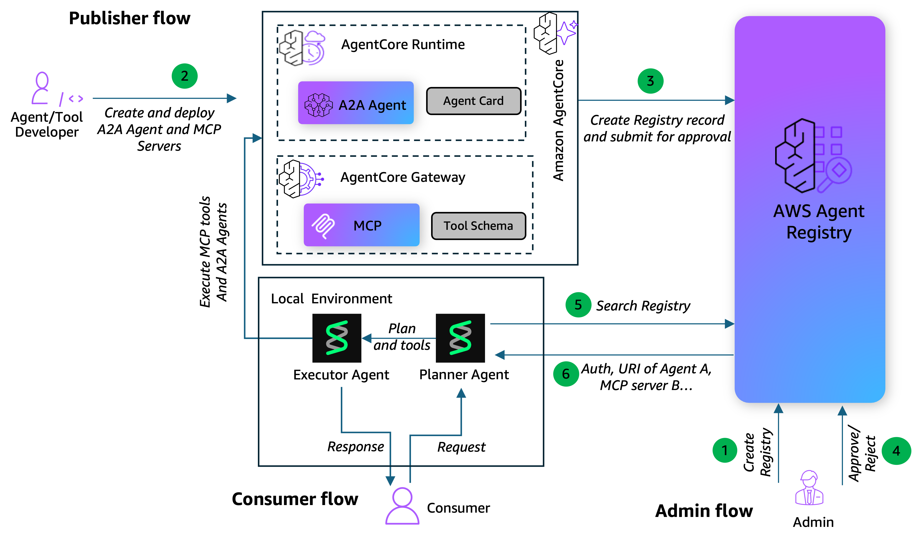

# Planner + Executor: Runtime Tool Discovery with AWS Agent Registry

## Overview

When building AI agents that need to discover and use tools at runtime, loading every
available tool into the LLM context upfront is expensive, slow, and wasteful. As your
tool catalog grows — across order management, payments, shipping, notifications, and
more — the token cost and latency of stuffing all tool schemas into every request
becomes a real bottleneck.

This solution demonstrates the **Planner + Executor pattern**, a two-phase approach to
runtime tool discovery that solves this problem:

1. **Planner Agent** — receives a task, searches the AWS Agent Registry to discover
   which tools are relevant, and outputs a minimal Tool Plan. It never executes
   business logic — it only identifies what's needed.

2. **Executor Agent** — loads only the tools specified in the Plan, creates live
   connections to MCP servers and A2A agents, and executes the task step by step.

This pattern delivers three key benefits:

- **Runtime discovery** — agents find the right tools dynamically from the Registry
  instead of hardcoding them, so new tools become available without redeploying agents
- **Token optimization** — the Executor's context contains only the tools it needs
  (e.g., 2-3 out of 12), significantly reducing input tokens and cost compared to
  loading everything upfront
- **Faster execution** — smaller context means faster LLM inference and fewer
  irrelevant tool calls

In this solution you will be using **real deployed services** — 9 MCP tools on AgentCore Gateway and
3 A2A agents on AgentCore Runtime — to run 3 end-to-end e-commerce scenarios. You will perform runtime discovery of the required MCP servers and A2A agents for each scenario using Planner agent and then use Executor agent to execute the scenario based on the plan and tools provided by the Planner agent. You will also analyze the token and cost savings that comes with runtime tool discovery and execution.

| Tool | Protocol | Purpose |
|---|---|---|
| `order_lookup_tool` | MCP | Look up order details and list orders by customer |
| `order_update_tool` | MCP | Update order status or shipping address |
| `order_cancel_tool` | MCP | Cancel an order |
| `email_send_tool` | MCP | Send transactional emails to customers |
| `email_template_tool` | MCP | Manage reusable email templates |
| `sms_notify_tool` | MCP | Send SMS notifications |
| `payment_status_tool` | MCP | Look up payment status for an order |
| `inventory_check_tool` | MCP | Check available stock for one or more SKUs |
| `shipping_track_tool` | MCP | Track shipments and get delivery estimates |
| `returns_processing_tool` | MCP (remote) | Process product returns and generate return labels |
| `loyalty_rewards_tool` | MCP (remote) | Manage loyalty points and redeem rewards |
| `payment_refund_tool` | A2A | Issue refunds with multi-step validation |
| `inventory_reserve_tool` | A2A | Reserve inventory with rollback support |
| `shipping_update_tool` | A2A | Create shipments with carrier selection and status updates |

## Architecture

## Tutorial
You will find below 3 notebooks to be executed in order for walking through the solution. The first 2 notebooks will deploy the MCP servers and A2A agents to Amazon AgentCore Gateway and Amazon AgentCore Runtime. These notebooks will create mcp_tools_config.json and a2a_agents_config.json files respectively contaning the metadata needed for AWS Registry. Use the Planner Executor notebook to register the MCP servers and A2A agents with AWS Registry, performing dynamic discovery of MCP Servers and A2A agents from AWS Agent Registry and run end to end e-commerce scenarios.

1. [Deploy MCP Servers](00-deploy-sample-mcp-tools.ipynb)
2. [Deploy A2A Agents](00-deploy-sample-a2a-agents.ipynb)
3. [Planner Executor Pattern](planner-executor.ipynb)