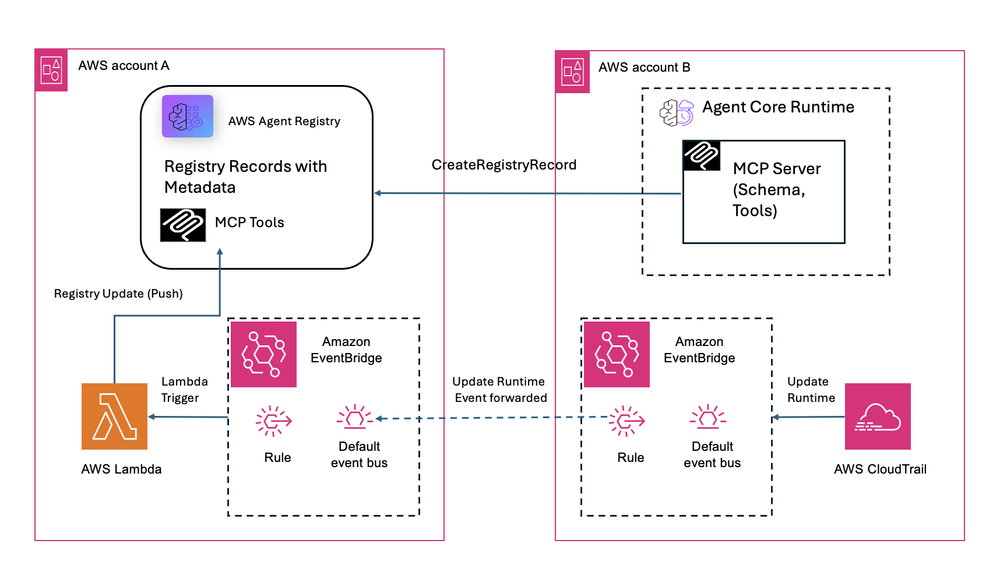

# Synchronizing Metadata with the AWS Agent Registry

## Overview

There are two ways to keep MCP and A2A server metadata in sync with the AWS Agent Registry: pull-based and push-based.

With a pull-based approach, the registry reaches out to the underlying servers to fetch their metadata directly. This requires the registry to have credentials to access each server's data layer. Those credentials can expire, and sharing them with the registry may not be desirable from a security standpoint.

With a push-based approach, developers push metadata to the registry whenever their servers change. This keeps credentials secure — the registry never needs direct access to the underlying resources. It also enables a governance pipeline that gives you better control over what gets published. The tradeoff is monitoring for changes (typically via CloudTrail events), and if a developer misses processing an event, the registry can fall out of sync.

This notebook focuses on the push-based approach for Metadata Synchronization. It deploys a Lambda function that listens for `UpdateAgentRuntime` CloudTrail events via Amazon EventBridge, connects to the MCP server to discover its current tools, and updates the corresponding registry record if any tools have been added, removed, or modified. OAuth credentials are managed securely through AgentCore Identity, which means no client secrets need to be stored in Lambda environment variables.

The solution supports both single-account and cross-account architectures.

Note that the Lambda handles the business logic of detecting and pushing tool changes. The notebook includes steps to create the registry and register the MCP server record, but these can also be done separately if you already have a registry set up. 
See the [Known Limitations](#known-limitations) section for details on versioning and approval behavior.

## Prerequisites

- An AWS account with IAM credentials that have permissions to create Lambda functions, IAM roles, and EventBridge rules. It should also have a policy which allows required AWS Agent Registry fucntions. 
- An MCP server deployed on AgentCore Runtime with Cognito OAuth configured for authentication.
- The notebook helps create Agent Registry and MCP server record in it. In case the Registry or MCP record is already existing, those cells can be skipped. 
- Python 3.10+ with boto3 installed (the notebook handles installation via `requirements.txt`).
- For cross-account setups, AWS CLI profiles configured for both Account A and Account B.

## Architecture



The diagram shows the end-to-end event flow from an AgentCore Runtime update in Account B through EventBridge forwarding to Account A, where the Lambda function queries the MCP server for its tools and updates the matching registry record. For single-account deployments, the cross-account forwarding step is skipped and events flow directly within Account A.

This solution involves two types of AWS accounts:

- **Account A (Registry Account)** owns the AWS Agent Registry, the EventBridge rule, the push sync Lambda function, and CloudWatch Logs.
- **Account B (MCP Server Account)** hosts the MCP server runtime and the Cognito OAuth provider used for authentication.

For single-account deployments, all resources reside in Account A and the cross-account forwarding step is not needed.

### Components

The following AWS services are used in this solution:

- **CloudTrail** captures `UpdateAgentRuntime` API calls in both accounts.
- **EventBridge** routes events to the Lambda function. In cross-account setups, Account B forwards events to Account A's default event bus.
- **Lambda** processes the events, queries the MCP server for its tools, and updates the registry.
- **AWS Agent Registry** stores MCP server records along with their tool schemas.
- **AgentCore Identity** manages OAuth credentials securely through workload identities and credential providers, eliminating the need to store secrets in Lambda environment variables.
- **Amazon Cognito** serves as the OAuth provider for MCP server authentication in each account.

## Detailed Cross-Account Flow

The following describes the end-to-end flow when an MCP server in Account B is updated and the registry in Account A needs to be synced.

### Phase 1: Event Generation (Account B)
1. Developer deploys or updates MCP server via `agentcore launch`
2. AgentCore calls `UpdateAgentRuntime` API
3. CloudTrail logs the API call as a management event (~5 min delivery delay). No CloudTrail data events need to be enabled.
4. Event delivered to Account B's default EventBridge bus

### Phase 2: Event Forwarding (Account B → Account A)
5. EventBridge rule `forward-runtime-updates` matches the event
6. EventBridge assumes `EventBridgeForwardRole` in Account B
7. Event forwarded to Account A's default EventBridge bus
8. Account A accepts it via resource-based policy

### Phase 3: Lambda Trigger (Account A)
9. EventBridge rule in Account A matches the event
10. `registry-push-sync-lambda` is invoked

### Phase 4: MCP Server Query (Lambda → Account B)
11. Extract `agentRuntimeArn` from `detail.responseElements`
12. Parse ARN to identify source account
13. Construct MCP server invocation URL from ARN
14. Obtain workload access token from AgentCore Identity
15. Fetch OAuth bearer token from credential provider (M2M flow)
16. Call MCP server `initialize` → `tools/list`

### Phase 5: Registry Comparison and Update (Account A)
17. List all records in the registry
18. For each APPROVED record, check if `server.inlineContent` contains the runtime ARN
19. Extract existing tools from matched record's `tools.inlineContent`
20. Normalize both tool lists (sort by name, compare name/description/inputSchema)
21. If identical → skip update
22. If different → log diff, update registry record

## Setup Guide

All resources can be deployed using the `deploy_lambda_push_sync.ipynb` notebook. The cells should be run in order, as each section builds on the previous one.

| Notebook Section | What It Does |
|-----------------|--------------|
| 0. Install Dependencies | Installs boto3 and botocore from requirements.txt. |
| 1. Configuration | Sets the AWS region, Lambda name, registry name, MCP server details, credential provider names per account, and cross-account IDs. |
| 2. Create Registry | Creates an AWS Agent Registry and waits for it to become READY. |
| 3. Create Registry Record | Creates a registry record for the MCP server with the runtime ARN in the server schema. |
| 3.1 Approve Record | Moves the record through DRAFT → PENDING_APPROVAL → APPROVED so the Lambda can sync to it. |
| 4. Create AgentCore Identity Credential Providers | Creates a workload identity for the Lambda and OAuth2 credential providers for each MCP server account. |
| 5. Create IAM Role for Lambda | Creates the Lambda execution role with permissions for registry access, AgentCore Identity, and Secrets Manager. |
| 6. Build and Create Lambda | Packages `handler.py` along with `boto3`, `botocore`, and `requests` into a zip, then creates or updates the Lambda function. |
| 7. Create EventBridge Rule | Creates an EventBridge rule that matches `UpdateAgentRuntime` CloudTrail events and targets the Lambda function. |
| 8. Cross-Account Setup (optional) | Grants Account B permission to send events to Account A's bus, and creates the forwarding IAM role and EventBridge rule in Account B. |
| | **Deployment is complete after section 8. The sections below are optional.** |
| 9. Test the Lambda | Manually invokes the Lambda with a synthetic CloudTrail event. |
| 10. Check Lambda Logs | Displays the most recent CloudWatch log stream for the Lambda function. |
| 11. Cleanup | Tears down all resources created by the notebook, including the registry, records, Account A resources, Account B resources, and AgentCore Identity resources. |

## Resource Details

### Account A (Registry Account)

#### AgentCore Identity

The Lambda function uses AgentCore Identity to obtain OAuth tokens without storing client secrets in its environment variables. Two types of resources are created:

| Resource | Description |
|----------|-------------|
| Workload Identity | Represents the Lambda function as a trusted caller within AgentCore Identity (e.g. `registry-push-sync-agent`). |
| Credential Provider (per account) | Stores the Cognito OAuth configuration securely, including the token endpoint, client ID, and client secret. |

#### EventBridge Rule

An EventBridge rule is created to match `UpdateAgentRuntime` CloudTrail events and invoke the Lambda function.

| Setting       | Value                                                                 |
|---------------|-----------------------------------------------------------------------|
| Pattern       | `source: aws.bedrock-agentcore`, `detail-type: AWS API Call via CloudTrail`, `detail.eventName: UpdateAgentRuntime` |
| Targets       | Lambda function (and optionally CloudWatch Logs)                      |

#### Lambda Function

The Lambda function is deployed with the following configuration:

| Setting       | Value                                                                 |
|---------------|-----------------------------------------------------------------------|
| Runtime       | Python 3.12                                                           |
| Handler       | `handler.handler`                                                     |
| Memory        | 128 MB                                                                |
| Timeout       | 30 seconds                                                            |

#### Lambda Environment Variables

The following environment variables are configured on the Lambda function. Note that no client secrets are stored here — they are managed by AgentCore Identity.

| Variable                          | Description                                              |
|-----------------------------------|----------------------------------------------------------|
| `REGISTRY_ID`                     | The registry ID to search and update records in.          |
| `WORKLOAD_IDENTITY_NAME`          | The AgentCore workload identity name for this Lambda.     |
| `CREDENTIAL_PROVIDER_{ACCT_ID}`   | The AgentCore Identity credential provider name for each MCP server account. |
| `CREDENTIAL_SCOPE_{ACCT_ID}`      | The OAuth scope required by each MCP server (optional).   |

#### Lambda IAM Role Policies

The Lambda execution role requires the following permissions:

| Policy                                    | Actions                                                              |
|-------------------------------------------|----------------------------------------------------------------------|
| Registry access                           | `bedrock-agentcore:ListRegistryRecords`, `bedrock-agentcore:GetRegistryRecord`, `bedrock-agentcore:UpdateRegistryRecord` |
| AgentCore Identity                        | `bedrock-agentcore:GetResourceOauth2Token`, `bedrock-agentcore:GetWorkloadAccessToken` |
| Secrets Manager                           | `secretsmanager:GetSecretValue` (required by AgentCore Identity to read stored credentials) |
| CloudWatch Logs                           | `logs:CreateLogGroup`, `logs:CreateLogStream`, `logs:PutLogEvents`   |

#### Lambda Resource Policy

The Lambda function's resource policy allows `events.amazonaws.com` to invoke the function, conditioned on the EventBridge rule ARN.

#### Event Bus Permission (Cross-Account Only)

For cross-account setups, a resource-based policy on Account A's default EventBridge bus allows each MCP server account to call `events:PutEvents`.

#### Registry Record Requirements

For the Lambda to match and update a registry record, the following conditions must be met:

| Requirement                | Detail                                                                |
|----------------------------|-----------------------------------------------------------------------|
| `server.inlineContent`     | Must contain the runtime URL or ARN so the Lambda can match the record to the MCP server. |
| Status                     | Must be `APPROVED`. The Lambda skips records in DRAFT status.         |
| Tool schema version        | `protocolVersion: 2025-06-18`                                         |

### Account B (MCP Server Account — Cross-Account Only)

The following resources are created in Account B to enable cross-account event forwarding.

#### EventBridge Forwarding Rule

| Setting       | Value                                                                 |
|---------------|-----------------------------------------------------------------------|
| Rule name     | `forward-runtime-updates`                                             |
| Pattern       | Same pattern as Account A's rule (`UpdateAgentRuntime` CloudTrail events). |
| Target        | Account A's default event bus ARN.                                    |
| Role          | `EventBridgeForwardRole`                                              |

#### IAM Role: EventBridgeForwardRole

This IAM role allows EventBridge in Account B to forward events to Account A.

| Setting       | Value                                                                 |
|---------------|-----------------------------------------------------------------------|
| Trust         | `events.amazonaws.com`                                                |
| Policy        | `events:PutEvents` on Account A's default event bus ARN.              |

#### Cognito

Each MCP server account requires a Cognito user pool with an app client configured for the client credentials (M2M) flow. The Cognito configuration is stored in an AgentCore Identity credential provider in Account A.

| Setting       | Value                                                                 |
|---------------|-----------------------------------------------------------------------|
| Flow          | Client credentials (M2M)                                              |
| Requirements  | A Cognito user pool with an app client and a resource server with a defined scope. |
| Managed by    | An AgentCore Identity credential provider in Account A.               |


## Testing

### Manual Lambda Invocation

You can manually invoke the Lambda function with a synthetic CloudTrail event to verify the end-to-end flow:

```bash
aws lambda invoke \
  --function-name registry-push-sync-lambda \
  --cli-binary-format raw-in-base64-out \
  --payload '{
    "detail-type": "AWS API Call via CloudTrail",
    "source": "aws.bedrock-agentcore",
    "detail": {
      "eventName": "UpdateAgentRuntime",
      "awsRegion": "us-west-2",
      "responseElements": {
        "agentRuntimeArn": "arn:aws:bedrock-agentcore:us-west-2:<ACCT_ID>:runtime/<RUNTIME_ID>",
        "status": "UPDATING"
      }
    }
  }' \
  --region us-west-2 \
  /tmp/output.json

cat /tmp/output.json | python3 -m json.tool
```

### Check Lambda Logs

To view the most recent Lambda execution logs:

```bash
aws logs tail /aws/lambda/registry-push-sync-lambda --region us-west-2 --since 10m --format short
```

### Build and Deploy

After making changes to `handler.py` or the service model, redeploy the Lambda function:

```bash
cd registry-push-sync-lambda
zip -r handler.zip handler.py models/
aws lambda update-function-code \
  --function-name registry-push-sync-lambda \
  --zip-file fileb://handler.zip \
  --region us-west-2
```

## Known Limitations

The Lambda function updates existing registry records but does not create new ones. A matching registry record must already exist in the registry with the MCP server's runtime ARN in its `server.inlineContent` field. The notebook handles this in sections 2 and 3, but if you skip those steps, you must create the record manually. If no matching record is found, the sync is skipped.

Record versioning is not currently implemented. When tools change, the Lambda updates the existing record in place regardless of the nature of the change. This means minor changes such as a tool description update are treated the same way as major changes such as new tools being added, tools being removed, or input schema mutations. A future improvement could distinguish between minor and major version changes — for example, creating a new record version for breaking changes and deprecating the older one.

When the Lambda updates a record, the registry automatically reverts the record's status to DRAFT. This forces a formal review through the DRAFT → PENDING_APPROVAL → APPROVED workflow before the updated tools are visible to consumers. This behavior is by design and ensures that all changes go through a governance review, but it does mean that tool updates are not immediately available until an administrator approves them.

## Troubleshooting

The following table lists common issues and their resolutions:

| Symptom                              | Cause                                    | Fix                                                        |
|--------------------------------------|------------------------------------------|------------------------------------------------------------|
| Lambda not triggered                 | CloudTrail delivery delay (5–15 min)     | Wait and check EventBridge metrics.                        |
| Lambda not triggered                 | Account B forwarding rule missing        | Verify the rule exists and is ENABLED in Account B.        |
| Lambda not triggered                 | Account A bus doesn't allow Account B    | Run `aws events put-permission` for Account B.             |
| 0 tools returned                     | MCP server cold start                    | Warm up the server and retry.                              |
| No matching record                   | Server schema missing runtime ARN        | Recreate the record with the correct URL in `server.inlineContent`. |
| No matching record                   | Record in DRAFT status                   | Approve the record through the DRAFT → PENDING_APPROVAL → APPROVED workflow. |
| Auth error (secretsmanager)          | Lambda role missing Secrets Manager perm | Add `secretsmanager:GetSecretValue` to the Lambda role.    |
| Auth error (workload token)          | Lambda role missing identity perm        | Add `bedrock-agentcore:GetWorkloadAccessToken` to the Lambda role. |
| Auth error (credential provider)     | Wrong provider name for account          | Check the `CREDENTIAL_PROVIDER_{ACCT_ID}` environment variable on the Lambda. |
| Registry update fails                | Lambda role missing permissions          | Add `bedrock-agentcore:UpdateRegistryRecord` to the Lambda role. |
| `no_change` when expecting update    | Tools are identical                      | Verify that the tool names, descriptions, or inputSchemas actually differ. |